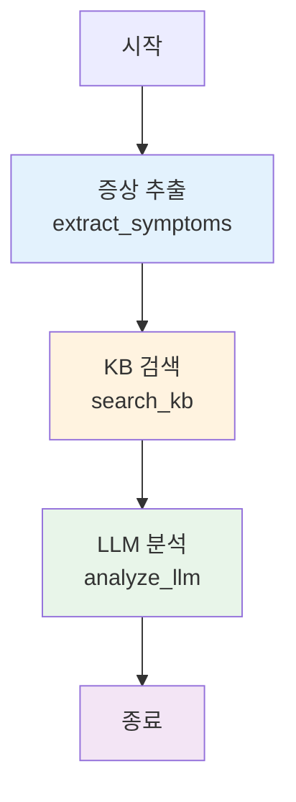

# 🔄 CI 오류 분석 워크플로우 다이어그램

## 📊 전체 시스템 아키텍처

```
┏━━━━━━━━━━━━━━━━━━━━━━━━━━━━━━━━━━━━━━━━━━━━━━━━━━━━━━━━━━━━┓
┃                    CI/CD 시스템 (Bamboo)                      ┃
┗━━━━━━━━━━━━━━━━━━━━━━━━━━━━━━━━━━━━━━━━━━━━━━━━━━━━━━━━━━━━┛
                            │
                            │ 빌드 실패
                            │
                            ↓
        ┌───────────────────────────────────────┐
        │  오류 로그 캡처 & API 호출             │
        │  POST /analyze                        │
        │  {                                    │
        │    "ci_log": "error log...",          │
        │    "repository": "automotive-ecu"     │
        │  }                                    │
        └───────────────┬───────────────────────┘
                        │
                        ↓
┏━━━━━━━━━━━━━━━━━━━━━━━━━━━━━━━━━━━━━━━━━━━━━━━━━━━━━━━━━━━━┓
┃           LangGraph 워크플로우 (Agent)                        ┃
┃                                                               ┃
┃   ┌─────────────────────────────────────────────────────┐   ┃
┃   │  Node 1: 증상 추출 (extract_symptoms)              │   ┃
┃   │                                                     │   ┃
┃   │  📝 정규식 패턴 매칭:                               │   ┃
┃   │    • Tasking: "c166", "code generation"            │   ┃
┃   │    • NXP: "s32k", "undefined reference"            │   ┃
┃   │    • Polyspace: "misra", "violation"               │   ┃
┃   │    • Simulink: "model", "simulink"                 │   ┃
┃   │    • AUTOSAR: "arxml", "swc"                       │   ┃
┃   │    • CAN: "can", "dbc"                             │   ┃
┃   │                                                     │   ┃
┃   │  🎯 오류 타입 자동 분류:                            │   ┃
┃   │    symptoms → error_type 매핑                      │   ┃
┃   └──────────────────┬──────────────────────────────────┘   ┃
┃                      │                                       ┃
┃                      │ symptoms, error_type                  ┃
┃                      ↓                                       ┃
┃   ┌─────────────────────────────────────────────────────┐   ┃
┃   │  Node 2: KB 검색 (search_knowledge_base)           │   ┃
┃   │                                                     │   ┃
┃   │  🔍 검색 방법:                                      │   ┃
┃   │    Option 1: TF-IDF (scikit-learn 있을 때)        │   ┃
┃   │      - 벡터화 및 코사인 유사도                    │   ┃
┃   │      - 정확도: ⭐⭐⭐⭐⭐                          │   ┃
┃   │                                                     │   ┃
┃   │    Option 2: 키워드 매칭 (없을 때)                │   ┃
┃   │      - 공통 단어 개수 계산                        │   ┃
┃   │      - 정확도: ⭐⭐⭐⭐                            │   ┃
┃   │                                                     │   ┃
┃   │  📊 신뢰도 계산:                                    │   ┃
┃   │    kb_confidence = avg_score + count_bonus         │   ┃
┃   └──────────────────┬──────────────────────────────────┘   ┃
┃                      │                                       ┃
┃                      │ kb_hits, kb_confidence                ┃
┃                      ↓                                       ┃
┃   ┌─────────────────────────────────────────────────────┐   ┃
┃   │  Node 3: LLM 분석 (analyze_with_llm)               │   ┃
┃   │                                                     │   ┃
┃   │  🤖 LLM 있을 때:                                    │   ┃
┃   │    Private LLM/OpenAI                              │   ┃
┃   │    → 상세 분석 및 해결책                          │   ┃
┃   │    → 신뢰도: 0.8-0.95                             │   ┃
┃   │                                                     │   ┃
┃   │  🔧 LLM 없을 때:                                    │   ┃
┃   │    Fallback 분석                                   │   ┃
┃   │    → 증상 요약 + 일반 해결책                      │   ┃
┃   │    → 신뢰도: 0.7                                   │   ┃
┃   └──────────────────┬──────────────────────────────────┘   ┃
┃                      │                                       ┃
┃                      │ analysis, confidence                  ┃
┃                      ↓                                       ┃
┃   ┌─────────────────────────────────────────────────────┐   ┃
┃   │  최종 결과 생성                                     │   ┃
┃   │  {                                                  │   ┃
┃   │    "error_type": "tasking",                        │   ┃
┃   │    "symptoms": [...],                              │   ┃
┃   │    "kb_confidence": 0.85,                          │   ┃
┃   │    "analysis": "분석 내용...",                     │   ┃
┃   │    "confidence": 0.75                              │   ┃
┃   │  }                                                  │   ┃
┃   └─────────────────────────────────────────────────────┘   ┃
┗━━━━━━━━━━━━━━━━━━━━━━━━━━━━━━━━━━━━━━━━━━━━━━━━━━━━━━━━━━━━┛
                            │
                            │ Response
                            ↓
        ┌───────────────────────────────────────┐
        │  FastAPI Response                     │
        │  {                                    │
        │    "analysis_id": 123,                │
        │    "error_type": "tasking",           │
        │    "confidence": 0.75,                │
        │    "analysis": "...",                 │
        │    "approval_token": "eyJ...",        │
        │    "modify_token": "eyJ...",          │
        │    "approval_url": "http://...",      │
        │    "modify_url": "http://..."         │
        │  }                                    │
        └───────────────┬───────────────────────┘
                        │
                        ↓
┏━━━━━━━━━━━━━━━━━━━━━━━━━━━━━━━━━━━━━━━━━━━━━━━━━━━━━━━━━━━━┓
┃                CI 시스템이 이메일 전송                        ┃
┃                                                               ┃
┃   To: developer@company.com, admin@company.com               ┃
┃                                                               ┃
┃   ┌─────────────────────────────────────────────────────┐   ┃
┃   │  🚗 CI 오류 분석 결과                               │   ┃
┃   │                                                     │   ┃
┃   │  오류 타입: Tasking Compiler                       │   ┃
┃   │  신뢰도: 75%                                        │   ┃
┃   │                                                     │   ┃
┃   │  분석 내용: [...]                                   │   ┃
┃   │                                                     │   ┃
┃   │  ┌───────────────┐  ┌────────────────┐            │   ┃
┃   │  │ ✅ 바로 저장  │  │ ✏️ 수정 후 저장│            │   ┃
┃   │  └───────────────┘  └────────────────┘            │   ┃
┃   └─────────────────────────────────────────────────────┘   ┃
┗━━━━━━━━━━━━━━━━━━━━━━━━━━━━━━━━━━━━━━━━━━━━━━━━━━━━━━━━━━━━┛
              │                            │
              │                            │
     ✅ 클릭  │                   ✏️ 클릭  │
              ↓                            ↓
    ┌──────────────────┐        ┌──────────────────────┐
    │ GET /approve/... │        │ GET /modify/...      │
    │                  │        │                      │
    │ → KB에 바로 저장 │        │ → 수정 폼 페이지     │
    │                  │        │   ┌──────────────┐  │
    │ ✅ 완료!         │        │   │ 제목:  _____ │  │
    └──────────────────┘        │   │ 요약:  _____ │  │
                                │   │ 해결:  _____ │  │
                                │   │ 태그:  _____ │  │
                                │   └──────────────┘  │
                                │   [수정 후 저장]     │
                                └──────┬───────────────┘
                                       │
                                       ↓
                            ┌──────────────────────┐
                            │ POST /api/modify/... │
                            │ → 수정 내용 저장     │
                            │                      │
                            │ 자동 리다이렉트:     │
                            │ /approve/...         │
                            └──────┬───────────────┘
                                   │
                                   ↓
                            ┌──────────────────┐
                            │ KB에 저장 완료   │
                            │ ✅ 성공!         │
                            └──────────────────┘
                                   │
                                   ↓
                    ┌────────────────────────────┐
                    │  다음 분석부터 KB 활용     │
                    │  → 정확도 향상! 🎯        │
                    └────────────────────────────┘
```

## 🎨 노드 플로우 (LangGraph)



## 📈 워크플로우 상세

### Stage 1: 증상 추출
```
입력: CI 로그 (500-10,000 줄)
      ↓
정규식 패턴 매칭
      ↓
5-20개 핵심 증상 추출
      ↓
오류 타입 자동 분류
```

### Stage 2: KB 검색
```
증상 → 쿼리 생성
      ↓
KB 검색 (TF-IDF 또는 키워드)
      ↓
Top 5 유사 해결책
      ↓
신뢰도 계산 (0.0-1.0)
```

### Stage 3: LLM 분석
```
증상 + KB 결과 + 오류 타입
      ↓
프롬프트 생성
      ↓
LLM 호출 또는 Fallback
      ↓
분석 결과 생성
```

## ⏱️ 성능 지표

| 단계 | 소요 시간 | 출력 |
|------|-----------|------|
| 증상 추출 | ~0.5초 | symptoms, error_type |
| KB 검색 | ~1초 | kb_hits, kb_confidence |
| LLM 분석 | ~2-5초 | analysis, confidence |
| **총계** | **3-7초** | **완전한 분석 결과** |

## 🎯 의사결정 흐름

```
증상 추출 성공?
    ├─ Yes → KB 검색
    └─ No → Fallback (로그 마지막 줄 사용)

KB 결과 있음?
    ├─ Yes → 신뢰도 계산
    └─ No → LLM만 사용

LLM 사용 가능?
    ├─ Yes → LLM 분석 (높은 품질)
    └─ No → Fallback 분석 (기본 품질)

신뢰도 높음? (>0.7)
    ├─ Yes → KB 저장 권장
    └─ No → 참고용으로만 제공
```

## 🔄 KB 학습 사이클

```
┌──────────────┐
│  분석 실행   │
└──────┬───────┘
       ↓
┌──────────────┐
│  결과 검토   │ ← 개발자/관리자
└──────┬───────┘
       ↓
  유용한가?
    ├─ Yes → ┌──────────────┐
    │        │ KB에 저장    │
    │        └──────┬───────┘
    │               ↓
    │        ┌──────────────┐
    │        │  수정 필요?  │
    │        └──┬───────┬───┘
    │           │       │
    │      No  │       │ Yes
    │           ↓       ↓
    │     [바로 저장] [수정 후 저장]
    │           │       │
    │           └───┬───┘
    │               ↓
    │        ┌──────────────┐
    │        │ KB 업데이트  │
    │        └──────┬───────┘
    │               ↓
    │        ┌──────────────┐
    │        │ 다음 분석부터│
    │        │ 정확도 향상  │
    │        └──────────────┘
    │
    └─ No → 무시 (KB 저장 안 함)
```

## 🎨 상태 전이 다이어그램

```
Initial State
    │
    │ ci_log, repository
    ↓
[증상 추출]
    │
    │ + symptoms
    │ + error_type
    ↓
[KB 검색]
    │
    │ + kb_hits
    │ + kb_confidence
    ↓
[LLM 분석]
    │
    │ + analysis
    │ + confidence
    ↓
Final State
```

## 📊 데이터 흐름

```
CI Log (Raw)
    ↓ (extract_symptoms)
Symptoms (List[str])
    ↓ (search_kb)
KB Hits (List[Dict])
    ↓ (analyze_llm)
Analysis (str)
    ↓ (FastAPI)
Response (JSON)
    ↓ (CI System)
Email (HTML)
    ↓ (Admin)
KB Update
```

## 🎉 완성된 워크플로우

**3단계 워크플로우:**
1. **증상 추출** - 자동차 SW 특화
2. **KB 검색** - 학습 기반
3. **LLM 분석** - 상세 해결책

**특징:**
- ✅ 단순하고 빠름 (3-7초)
- ✅ 안정적 (외부 의존성 최소)
- ✅ 보안 우수 (내부 데이터만)
- ✅ 학습 강화 (KB 기반)

**KB가 성장할수록 더 정확해집니다!** 🚗✨
